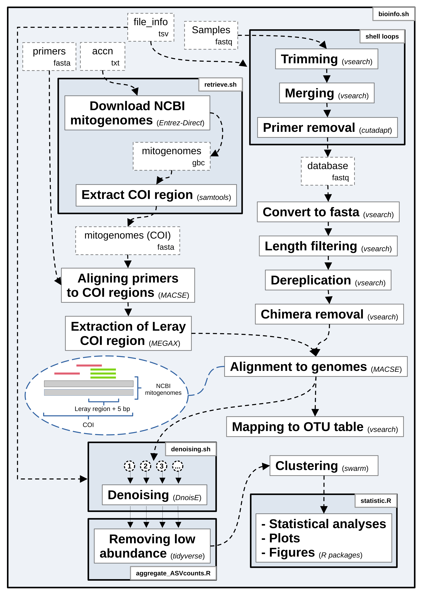

# ARMS/Seasonality pipeline

This repository store the scripts used in the paper from Cecchetto et al.1 "Seasonality of primary production explains the richness of pioneering benthic communities" to perform the bioinformatic and statistical analyses. The flowchart in the README.md file describe the main steps performed by the analyses, additional information can be recovered from the comments in the scripts and in the method section of the paper.

## Table of Contents

- [Usage](#usage)
- [Contact](#Contact)
- [Programs versions](#Programs-versions)
- [References](#references)

## Usage

<em>Flowchart displaying the main steps in the bioinformatic pipeline. Dash-encircled white boxes define files used in the analyses, continuous-encircled white boxes describe the main steps and analyses performed and tick-continuous-line encircled blue boxes represent the scripts used in the pipeline. Free-text subscripts define the extensions of the files used in the pipeline, whereas those enclosed in brackets define the programs or R packages used.</em>

  

The analyses can be reproduced by cloning this repository locally and running the commands in the shell script "bioinfo" (in scripts/main_scripts/) on the terminal.

The scripts provided in this repository perform the following steps:

1. Pre-processing of raw sequences, including reverse complementation, demultiplexing, and length truncation.
2. Sequence merging with a maximum of 2 differences in alignment.
3. Length filtering and primer removal.
4. Removal of sequences with low abundance.
5. Alignment of mitochondrial COI region sequences.
6. Denoising and recalculating abundance for each group of samples.
7. Clustering of dereplicated, aligned, and denoised sequences.
8. Collapsing the mOTU table based on clustering results.

Please refer to the individual scripts for more detailed information and instructions on how to use them.

## Contact

Inquiries can be forwarded to matteocecchetto@gmail.com

## Programs versions

The following packages and programs were used in the bioinformatic analyses:

### Bioinformatic analyses:

The bioinformatic analyses were performed on **Ubuntu** run on WSL2 on a 100.3GB RAM and 16 cores Windows system.

Distributor ID: Ubuntu  
Description:    Ubuntu 18.04.6 LTS  
Release:        18.04  
Codename:       bionic

Programs used (version number in brackets):

- **Python** (3.8)
- **R** (4.2.1)
- **fasterq-dump** (3.0.1) - Used to download the fastq files from the NCBI SRA (Sequence Read Archive). [Link to sra-tools](https://github.com/ncbi/sra-tools)
- **vsearch** (2.22.1) - Used for reverse complementing, demultiplexing, length truncation, sequence merging, length filtering, dereplication, and chimera removal. [Link to vsearch](https://github.com/torognes/vsearch)
- **fastqc** (0.11.5) - Used to visually check fastq files quality. [Link to fastqc](https://github.com/s-andrews/FastQC)
- **conda** (22.11.1) - A conda environment has been created including the cutadapt version mentioned below. [Link to conda](https://docs.conda.io/en/latest/)
- **cutadapt** (3.4) - Used to trim primers from the merged sequences. [Link to cutadapt](https://github.com/marcelm/cutadapt/)
- **openjdk** (11.0.17) - Java program used to run MACSE. [Link to openjdk](https://openjdk.org/)
- **MACSE** (2.06) - Alignment program for mitogenomes and fasta sequences. [Link to MACSE](https://www.agap-ge2pop.org/macse/#)
- **MEGAX** (10.2.6) - MEGAX was used to inspect the mitogenomes alignment and trim the same at the position of the primers. [Link to MEGA software](https://www.megasoftware.net/)
- **Entrez-Direct** (18.9) - Entrez-Direct suite of programs used to download and process records on the NCBI. [Link to documentation of Entrez-Direct](https://www.ncbi.nlm.nih.gov/books/NBK179288/)
- **samtools** (1.16.1) - Software to process fasta files, installed using htslib (1.16). [Link to samtools](https://github.com/samtools/samtools)
- **seqkit** (2.3.0) - Software to process fasta files. [Link to seqkit](https://bioinf.shenwei.me/seqkit/)
- **GNU parallel** (20161222) - Used to run the alignment step on multiple cores at the same time. [Link to GNU parallel](https://www.gnu.org/software/parallel/)
- **DnoisE** (1.2.0) - Used for the denoising procedure. [Link to DnoisE](https://github.com/adriantich/DnoisE)
- **Swarm** (3.1.3) - Used for the clustering procedure on ASVs. [Link to swarm](https://github.com/torognes/swarm)

### Statistical analyses:

The statistical analyses were performed on a **Ubuntu** system with a 15.5GB RAM and 8 cores.
All analyses, figures and plot were produced with R.

Distributor ID:	Ubuntu  
Description:		Ubuntu 20.04.6 LTS  
Release:			20.04  
Codename:		focal

- **phyloseq** (1.42.0)
- **tidyverse** (2.0.0)
- **lattice** (0.22.5)
- **cowplot** (1.1.1)
- **data.table** (1.14.6)
- **mgcv** (1.9.0)
- **fitdistrplus** (1.1.11)
- **corrplot** (0.92)
- **olsrr** (0.5.3)
- **ncf** (1.3.2)
- **Metrics** (0.1.4)
- **gratia** (0.8.1)
- **patchwork** (1.1.3)
- **RColorBrewer** (1.1.3)

Please refer to the respective links for instructions on how to install each package or program.

The final OTU table is provided in the directory "statistical\_analyses/", in order to reproduce exclusively the final analyses following the script "statistic.R" in the path "scripts/main\_scripts/".

## References

1 - Cecchetto et al. (2024) - https://doi.org/10.1038/s41467-024-52673-z
